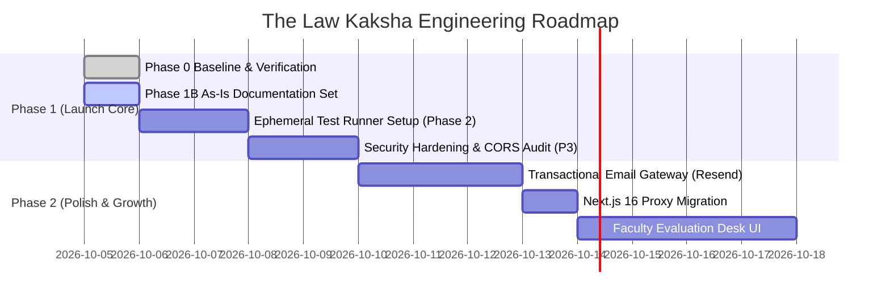

# Product Gap Analysis & Strategic Roadmap

**Purpose:** Identifies functional gaps, architectural debt, planned enhancements, and prioritization roadmap.  
**Status:** Verified against code & gap analysis  
**Last Verified:** 2026-10-05 (Commit `162ff8a`)  
**Owner:** TBD [owner input needed]  

---

## 1. Identified Functional & Technical Gaps

1. **Transactional Email & WhatsApp Receipts:** Currently, payment verification logs successful orders to server logs without triggering an external transactional email (e.g. via Resend, SendGrid, or AWS SES). Students rely on on-screen modal confirmation.
2. **Automated Ephemeral Test Harness:** `npm test` requires a manually started background server on port 5000. It needs a programmatic start/stop lifecycle hook so tests run cleanly in headless CI.
3. **Next.js 16 Middleware Deprecation:** Next.js 16 warns that `middleware.ts` should be migrated to `proxy.ts`.
4. **DevDependencies Security Warning:** 5 high-severity vulnerabilities exist in `braces` via `eslint-config-next@16.3.8`. Needs a non-breaking dependency resolution or override.
5. **Faculty Grading Interface:** Admin can grade submissions via raw API, but a dedicated UI for side-by-side student answer viewing and red-pen rubric marking is not yet built.

---

## 2. Phased Engineering Roadmap

### Milestone 1: Immediate Launch Readiness (Q4 2026)
- Stabilize test harness with programmatic server spin-up.
- Integrate Resend / SendGrid API keys for instant PDF access links via email.
- Complete Phase 9A legal policy drafts review with platform owner.

### Milestone 2: Academic Feature Expansion (Q1 2027)
- Faculty grading desk for subjective mock test papers.
- Student performance analytics dashboard with chapter-wise weakness tracking.
- Native WhatsApp updates for test evaluation announcements.
