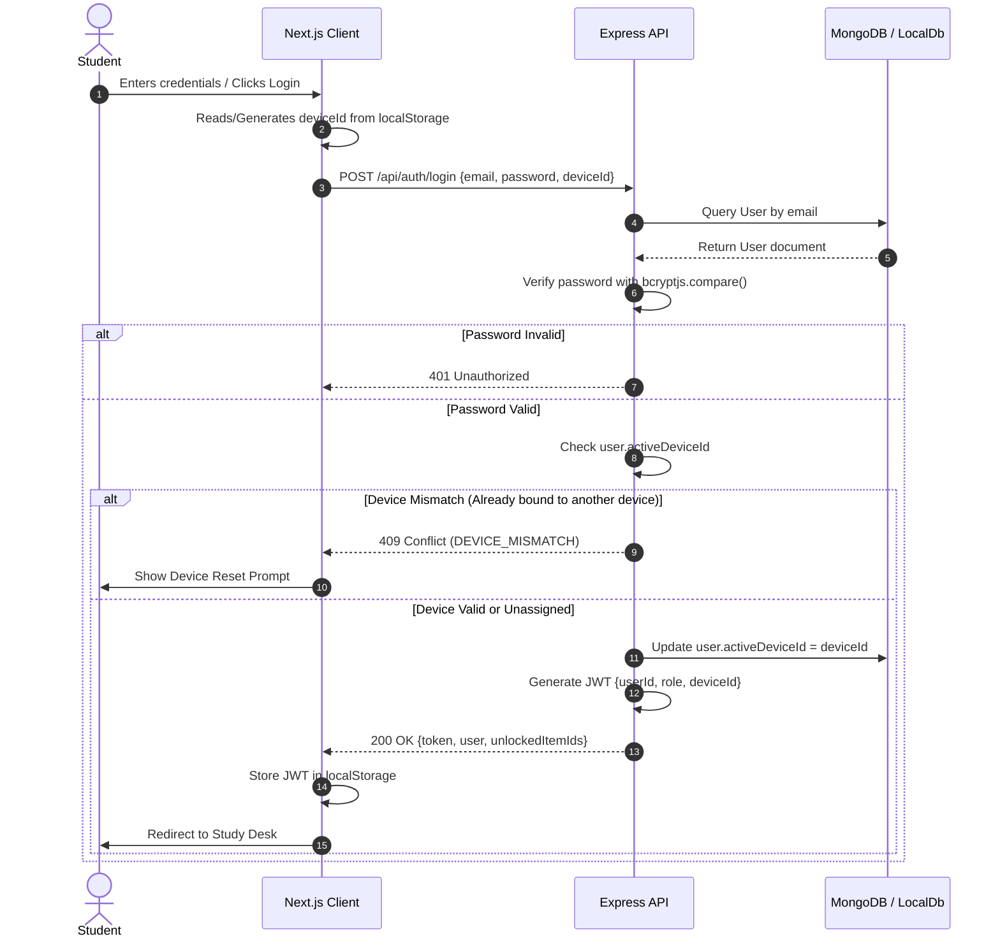
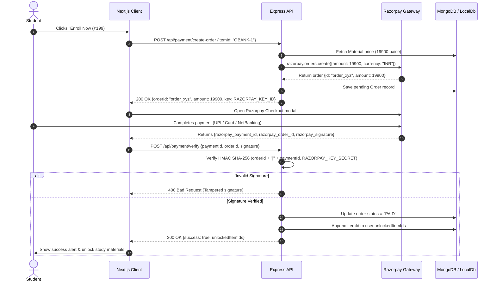
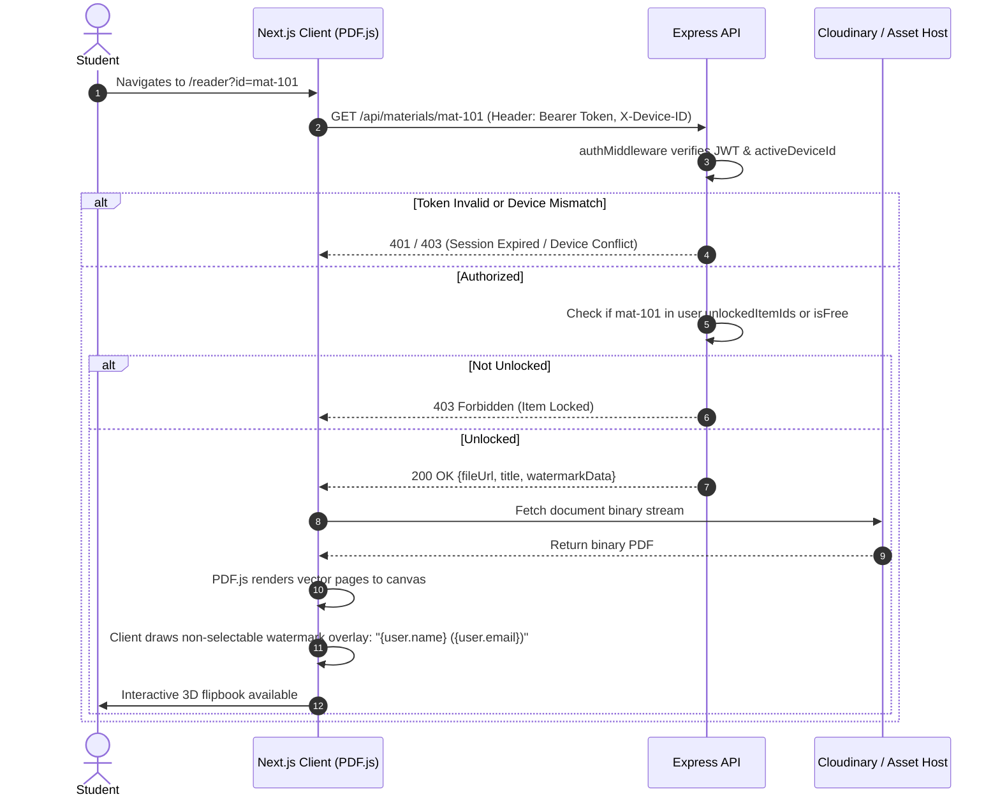

# User Journey & System Interaction Flows

**Purpose:** Visual interaction diagrams detailing core user journeys, validation boundaries, and subsystem state transitions.  
**Status:** Verified against code  
**Last Verified:** 2026-10-05 (Commit `162ff8a`)  
**Owner:** TBD [owner input needed]  

---

## 1. Student Registration, Device Binding & Authentication Flow

---

## 2. Course Access Pass Purchase & Fulfillment Flow (Razorpay)

---

## 3. In-Browser 3D Document Reader & Watermark Projection

