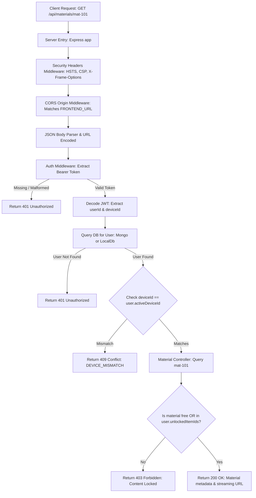

# Data Flow & Request Lifecycles

**Purpose:** Documents data flow lifecycles, synchronization mechanisms, and failure state transitions across the platform.  
**Status:** Verified against code  
**Last Verified:** 2026-10-05 (Commit `162ff8a`)  
**Owner:** TBD [owner input needed]  

---

## 1. Request Lifecycle: Authenticated Student Resource Access



---

## 2. Order Creation & Cryptographic Signature Verification Flow

```mermaid
flowchart TD
    O1[Client: Click Enroll / Unlock Pass] --> O2[POST /api/payment/create-order]
    O2 --> O3[Lookup Authoritative Item Price in DB: e.g. 19900 paise]
    O3 --> O4[Invoke Razorpay SDK: razorpay.orders.create]
    O4 --> O5[Persist Pending Order Record in Database]
    O5 --> O6[Return orderId & key to Frontend]
    O6 --> O7[Client: Open Razorpay Checkout Modal]
    O7 --> O8[Student completes payment on Razorpay]
    O8 --> O9[Client receives signature payload]
    O9 --> O10[POST /api/payment/verify]
    O10 --> O11[Compute HMAC SHA-256: razorpay_order_id + '|' + razorpay_payment_id]
    O11 --> O12{Does computed HMAC == razorpay_signature?}
    O12 -->|Mismatch / Tampered| O13[Log Security Alert & Return 400 Bad Request]
    O12 -->|Valid Match| O14[Update Order Status: PAID]
    O14 --> O15[Append Item ID to user.unlockedItemIds]
    O15 --> O16[Return 200 OK: Content Unlocked]
```
