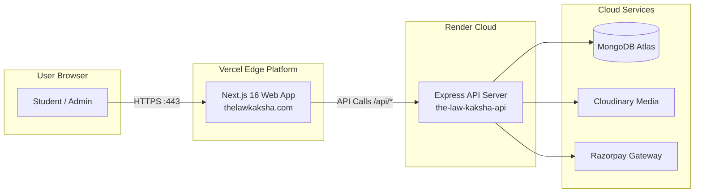

# Deployment & Infrastructure Topology

**Purpose:** Documents hosting infrastructure, CI/CD pipeline, environment configurations, and deployment topologies.  
**Status:** Verified against code & render.yaml  
**Last Verified:** 2026-10-05 (Commit `162ff8a`)  
**Owner:** TBD [owner input needed]  

---

## 1. Hosting Architecture Overview

---

## 2. Backend Infrastructure Specification (`render.yaml`)

- **Service Type:** Web Service (`web`)
- **Service Name:** `the-law-kaksha-api` [Verified: `render.yaml:3`]
- **Runtime:** `node` (Node.js 20+) [Verified: `render.yaml:4`]
- **Plan:** `free` (Subject to 15-minute idle spin-down) [Verified: `render.yaml:5`]
- **Region:** `oregon` (US West) [Verified: `render.yaml:6`]
- **Root Directory:** `backend` [Verified: `render.yaml:7`]
- **Build Command:** `npm install` [Verified: `render.yaml:8`]
- **Start Command:** `npm start` (`node src/server.js`) [Verified: `render.yaml:9`]
- **Health Check Path:** `/api/health` [Verified: `render.yaml:10`]

### Environment Variables Injected:
- `NODE_ENV`: `production` [Verified: `render.yaml:12`]
- `PORT`: `10000` [Verified: `render.yaml:14`]
- `FRONTEND_URL`: `https://thelawkaksha.com` [Verified: `render.yaml:17`]
- `JWT_SECRET`: Auto-generated random secret [Verified: `render.yaml:19`]
- `MONGODB_URI`: Encrypted cloud configuration [Verified: `render.yaml:20`]
- `RAZORPAY_KEY_ID`: Merchant Key ID [Verified: `render.yaml:22`]
- `RAZORPAY_KEY_SECRET`: Merchant Secret [Verified: `render.yaml:24`]

---

## 3. Frontend Hosting Specification (Vercel)

- **Framework Preset:** Next.js (detected automatically from `package.json`).
- **Build Command:** `next build --webpack` (defined in `frontend/package.json`).
- **Output Directory:** `.next`
- **Environment Variables:**
  - `NEXT_PUBLIC_API_URL`: Backend URL (e.g. `https://the-law-kaksha-api.onrender.com`).
  - `NEXT_PUBLIC_RAZORPAY_KEY_ID`: Public Razorpay key for client modal initialization.
  - `NEXT_PUBLIC_GOOGLE_CLIENT_ID`: Google OAuth web client ID.
