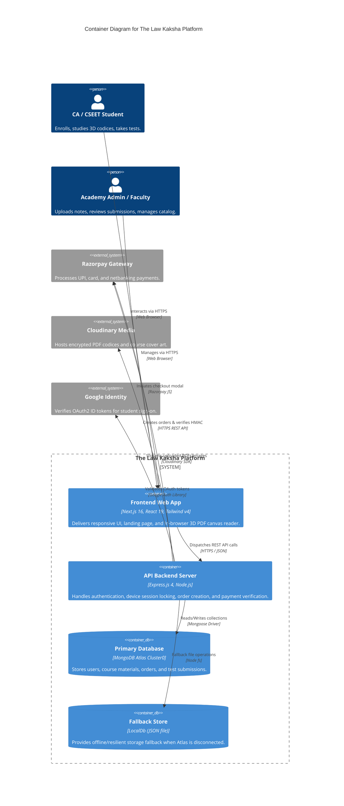

# System Architecture Overview

**Purpose:** High-level architectural specification, C4 container model, and technology topology.  
**Status:** Verified against code  
**Last Verified:** 2026-10-05 (Commit `162ff8a`)  
**Owner:** TBD [owner input needed]  

---

## 1. High-Level C4 Container Diagram

---

## 2. Core Architectural Patterns

1. **Decoupled Client-Server Monorepo:** Frontend and Backend reside in distinct root directories (`frontend/` and `backend/`) within the same Git repository, facilitating shared types and coordinated version control [Verified: `package.json`].
2. **Dual-Persistence Failover:** The backend boots with local JSON database fallback ready immediately (`backend/src/db/database.js`). If MongoDB Atlas connects successfully, the connection switches over seamlessly without interrupting HTTP endpoints [Verified: `backend/src/db/mongo.js`, `backend/src/config/db.js`].
3. **Stateless JWT with State-Checked Device Binding:** Authentication tokens are stateless JSON Web Tokens, but every incoming request checks the token's embedded `deviceId` against the user's active device record in database storage [Verified: `backend/src/middleware/authMiddleware.js:35`].
4. **Zero-Trust Digital Asset Delivery:** Study materials are served through authenticated streaming proxy endpoints. High-resolution source URLs are not exposed to the public web [Verified: `backend/src/routes/materialRoutes.js`].
