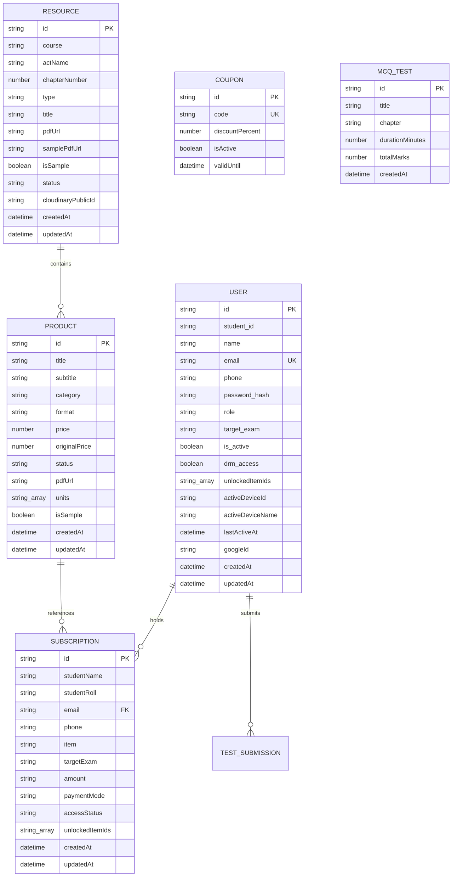

# Entity Relationship Diagram (ERD)

**Purpose:** Visual and relational mapping of database collections, entities, attributes, and foreign relationships.  
**Status:** Verified against code  
**Last Verified:** 2026-10-05 (Commit `162ff8a`)  
**Owner:** TBD [owner input needed]  

---

## 1. Relational Entity Diagram

