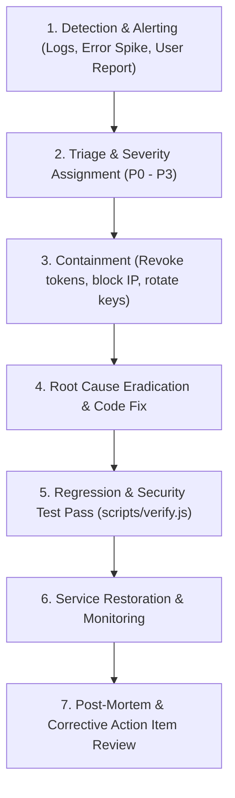

# Incident Response Plan

> **Purpose:** Procedures, severity triage, communication escalation, and containment protocols for security incidents.  
> **Status:** Verified against code  
> **Last Verified:** 2026-10-05 (`audit/2026-10-05`)  
> **Owner:** Security Specialist  

---

## 1. Incident Severity Classification

| Severity Level | Definition | Examples | SLA / Response Time |
|---|---|---|---|
| **P0 - Critical** | Active exploit of payments, widespread unauthorized access, database leak | Signature bypass on Razorpay, unauthenticated admin access, full database dump | Immediate (< 15 minutes) |
| **P1 - High** | Localized data breach, severe denial of service, DRM bypass tool active | IDOR allowing student data leakage, payment processor webhook outage | < 1 hour |
| **P2 - Medium** | Non-exploitable vulnerability, elevated error rate, rate limiter bypass | Flawed input validation on non-sensitive route, brute-force warning alerts | < 6 hours |
| **P3 - Low** | Minor security hygiene issue, dependency patch update | Non-critical devDependency vulnerability, outdated documentation | < 48 hours |

---

## 2. Response Lifecycle Workflow

---

## 3. Containment Runbooks

### 3.1 Rogue Admin Session or Key Leak
1. Invalidate all active tokens immediately by rotating `JWT_SECRET` in environment variables.
2. In MongoDB Atlas, deactivate compromised admin user accounts by setting `is_active: false`.
3. Check access logs for unauthorized administrative operations.

### 3.2 Payment Verification Discrepancy
1. Check Razorpay Dashboard transaction records against `orders` table.
2. If tampered requests are identified, revoke DRM access for corresponding `student_id` in database (`drm_access: 0`, `unlockedItemIds: []`).
3. Re-verify webhook secret and payment signature verification code.

### 3.3 DDoS or Brute Force Credential Attack
1. Verify sliding-window rate limiters are active on `/api/auth` and `/api/orders`.
2. Configure edge firewall IP bans on Cloudflare/Vercel or hosting platform.
