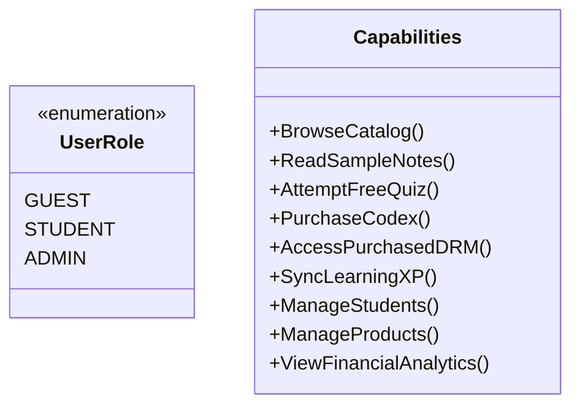

# Secrets Management & Access Control

> **Purpose:** Inventory of secrets, access credentials, environment variables, and rotation procedures.  
> **Status:** Verified against code  
> **Last Verified:** 2026-10-05 (`audit/2026-10-05`)  
> **Owner:** Security Specialist  

---

## 1. Secrets Inventory & Storage Rules

> [!IMPORTANT]
> No production secret, API private key, database URI password, or personal credential may ever be committed to git. All credentials must be loaded via runtime environment variables.

| Secret Name | Purpose | Location | Classification |
|---|---|---|---|
| `JWT_SECRET` | Signing and verifying student/admin authentication tokens | `backend/.env` | Critical |
| `MONGODB_URI` | MongoDB Atlas Cluster0 connection string with TLS | `backend/.env` | Critical |
| `RAZORPAY_KEY_ID` | Public gateway client identifier | `backend/.env`, `frontend/.env.local` | Public / Low |
| `RAZORPAY_KEY_SECRET` | HMAC signature verification & Orders API authentication | `backend/.env` | Critical |
| `CLOUDINARY_URL` / `API_SECRET` | Secure storage and asset management credentials | `backend/.env` | High |
| `GOOGLE_CLIENT_ID` | OAuth2 candidate authentication credential | `backend/.env`, `frontend/.env.local` | Public / Low |

---

## 2. Access Control & Role Matrix

| Route / Capability | Guest | Student (Active) | Administrator |
|---|:---:|:---:|:---:|
| `GET /api/public/*` | Allowed | Allowed | Allowed |
| `GET /api/catalog` | Allowed | Allowed | Allowed |
| `POST /api/auth/register`, `POST /api/auth/login` | Allowed | Allowed | Allowed |
| `POST /api/orders/create`, `POST /api/orders/verify` | Allowed | Allowed | Allowed |
| `GET /api/student/dashboard` | 401 Unauthorized | Allowed (Own data only) | Allowed (All students) |
| `POST /api/student/sync-progress` | 401 Unauthorized | Allowed (Own data only) | Allowed |
| `GET /api/orders/:id` | 401 Unauthorized | Allowed (Own order only) | Allowed (All orders) |
| `GET /api/admin/*` | 401 Unauthorized | 403 Forbidden | Allowed |
| `POST /api/admin/*` | 401 Unauthorized | 403 Forbidden | Allowed |

---

## 3. Secret Rotation Protocols

In the event of suspected compromise or routine scheduled rotation:
1. **JWT Secret Rotation:** Update `JWT_SECRET` in deployment environment (e.g., Render/Vercel). Existing sessions expire gracefully, requiring re-login.
2. **Razorpay Key Rotation:** Generate a new key pair in Razorpay Dashboard. Update `RAZORPAY_KEY_SECRET` on backend and `RAZORPAY_KEY_ID` on both backend and frontend.
3. **MongoDB Atlas Rotation:** Rotate database user credentials in MongoDB Atlas security console. Update `MONGODB_URI` connection string and restart backend service.
