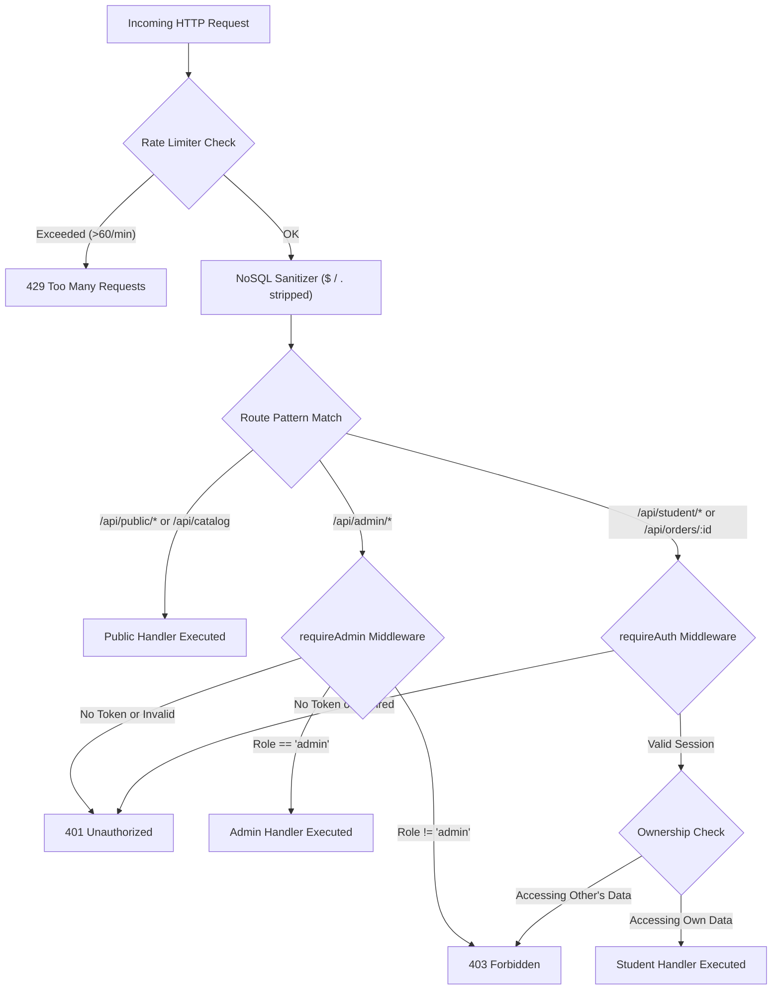

# Security Controls & Architecture

> **Purpose:** Technical inventory of security controls, authentication safeguards, authorization guards, and input sanitization across the application.  
> **Status:** Verified against code  
> **Last Verified:** 2026-10-05 (`audit/2026-10-05`)  
> **Owner:** Security Specialist  

---

## 1. Authentication & Session Management

| Security Mechanism | Implementation File | Verification & Behavior |
|---|---|---|
| **Password Hashing** | `backend/src/routes/authRoutes.js` | Bcrypt hashing with cost factor 10 (`bcrypt.hash(password, 10)`). No plaintext passwords stored. |
| **Token Architecture** | `backend/src/middleware/authMiddleware.js` | Signed JSON Web Tokens (`jwt.sign(..., JWT_SECRET, { expiresIn: "30d" })`). Secret sourced from environment. |
| **Single-Device Lockout** | `backend/src/routes/authRoutes.js` | Active device UUID (`activeDeviceId`) locked to student record. Secondary device login triggers `409 DEVICE_CONFLICT` unless explicit device transfer (`forceSwitchDevice: true`) is authorized. |
| **Heartbeat Revocation** | `backend/src/routes/authRoutes.js` | `/api/auth/device-heartbeat` checks client device ID against active record. Mismatch revokes session with `401 DEVICE_REVOKED`. |
| **Google OAuth Verification** | `backend/src/routes/authRoutes.js` | Verifies Google ID tokens using `google-auth-library` `OAuth2Client.verifyIdToken`. Rejects tampered tokens. |

---

## 2. Authorization & Access Control (OWASP ASVS Level 2)

### Access Control Rules:
1. **Admin Routes (`/api/admin/*`):** Mounted under `router.use("/admin", requireAdmin)` in `backend/src/routes/adminRoutes.js`.
2. **Student Dashboard (`/api/student/dashboard`):** Protected by `requireAuth` in `backend/src/routes/studentRoutes.js`. Unauthenticated requests return `401`. Students can only view their own dashboard unless the requester is an admin.
3. **Order Retrieval (`/api/orders/:id`):** Enforces ownership in `backend/src/routes/orderRoutes.js`. Non-owner students receive `403 Forbidden`.

---

## 3. Input Validation & Data Protection

1. **NoSQL Operator Injection Protection (`backend/src/server.js`):**
   - Intercepts all incoming requests (`req.body`, `req.query`, `req.params`).
   - Recursively deletes keys prefixed with `$` (MongoDB operators like `$gt`, `$ne`, `$where`) or containing dot notation `.`.
2. **Content-Type & Size Limits:**
   - JSON body parsing capped at 10MB (`express.json({ limit: "10mb" })`).
   - File uploads via Multer limited to 50MB in memory (`backend/src/routes/adminRoutes.js`).
3. **Price Manipulation Defense:**
   - Client-supplied prices are completely disregarded during checkout.
   - `handleCreateOrder` looks up canonical pricing from `CANONICAL_CATALOG_PRICES` server dictionary.
4. **Cryptographic Payment Integrity:**
   - Webhook and payment verification computes HMAC-SHA256 signature over `order_id|payment_id` using secret `RAZORPAY_KEY_SECRET`.

---

## 4. HTTP Security Headers

Configured globally in `backend/src/server.js`:
- `X-Content-Type-Options: nosniff`
- `X-Frame-Options: SAMEORIGIN`
- `Referrer-Policy: strict-origin-when-cross-origin`
- `Permissions-Policy: geolocation=(), camera=(), microphone=()`
- `Strict-Transport-Security: max-age=63072000; includeSubDomains; preload`
- `Content-Security-Policy: default-src 'self' ...`
- `X-Powered-By: Disabled`
