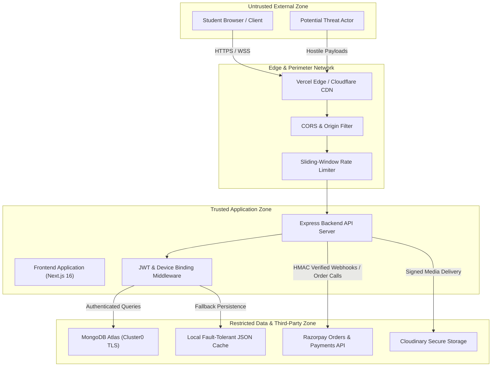

# Threat Model & Risk Assessment

> **Purpose:** STRIDE-based architectural threat modeling, attack surfaces, threat actors, and mitigation boundaries for The Law Kaksha platform.  
> **Status:** Verified against code  
> **Last Verified:** 2026-10-05 (`audit/2026-10-05`)  
> **Owner:** Security Specialist  

---

## 1. System Overview & Trust Boundaries

The Law Kaksha platform processes online student enrollments, statutory law courses, high-value proprietary study codices (PDF/DRM), interactive quizzes, and Razorpay financial transactions.

---

## 2. Threat Actors & Capabilities

| Threat Actor | Motivation | Capability | Primary Vector |
|---|---|---|---|
| **Pirate / Material Scraper** | Steal proprietary CA Foundation/CSEET notes to distribute on Telegram/WhatsApp | Medium | Automated browser scrapers, DOM inspection, session hijacking |
| **Credential Sharer** | Share 1 paid account across 10–50 students in study groups | Low–Medium | Multi-device concurrent login, credential sharing |
| **Tampering Attacker** | Purchase ₹99/₹180 courses for ₹1 or bypass Razorpay verification | Medium | Client payload tampering, webhook replay, forged HMAC signatures |
| **Malicious Student** | Access other candidates' dashboard, quiz responses, or personal data | Low–Medium | IDOR on `/api/student/dashboard` or `/api/orders/:id` |
| **Script Kiddie / Botnet** | Brute force admin credentials, spam registration, denial of service | Low | High-frequency brute-forcing, NoSQL operator injection |

---

## 3. STRIDE Threat Analysis Matrix

### 3.1 Spoofing Identity
- **Threat:** Attacker spoofs identity or signs JWT tokens using weak secrets.
- **Countermeasure:** 
  - Mandatory HMAC-SHA256 signature verification via strong `process.env.JWT_SECRET` (`backend/src/middleware/authMiddleware.js`).
  - Google OAuth token verification via official Google Auth client (`backend/src/routes/authRoutes.js`).
  - Single-device binding enforces unique `activeDeviceId` and revokes stale devices on concurrent login (`backend/src/routes/authRoutes.js`).

### 3.2 Tampering with Data
- **Threat:** Attacker modifies `price` in `POST /api/orders/create` from ₹99 to ₹1.
- **Countermeasure:**
  - Absolute server-side price validation using `CANONICAL_CATALOG_PRICES` lookup (`backend/src/routes/orderRoutes.js`).
  - Cryptographic Razorpay payment verification verifying `crypto.createHmac("sha256", secret)` over `order_id|payment_id` (`backend/src/routes/orderRoutes.js`).
  - NoSQL injection sanitizer stripping keys starting with `$` or containing `.` (`backend/src/server.js`).

### 3.3 Repudiation
- **Threat:** User claims they paid or that someone else initiated a purchase.
- **Countermeasure:**
  - Persistent order receipts with unique gateway transaction IDs (`gateway_payment_id`, `gateway_order_id`).
  - Device telemetry logging capturing IP address, user-agent, timestamp, and device name during device heartbeats and login.

### 3.4 Information Disclosure
- **Threat:** Exposure of database credentials, user password hashes, or unauthenticated candidate profiles.
- **Countermeasure:**
  - Strict projection excluding `password_hash` across all auth, student, and admin routes (`safeUser`, `.select("-password_hash")`).
  - Production security headers (`nosniff`, `SAMEORIGIN`, `strict-origin-when-cross-origin`, CSP) and `x-powered-by` disabled (`backend/src/server.js`).
  - IDOR protection on `/api/student/dashboard` and `/api/orders/:id` requiring authentic session matching requester.

### 3.5 Denial of Service
- **Threat:** Credential stuffing against `/api/auth/login` or payment spam on `/api/orders/create`.
- **Countermeasure:**
  - In-memory sliding-window rate limiters on `/api/auth` (60 req/min) and `/api/orders` / `/api/verify-payment` (60 req/min).
  - Maximum JSON payload limit of 10MB (`express.json({ limit: "10mb" })`).

### 3.6 Elevation of Privilege
- **Threat:** Student accesses `/api/admin/*` endpoints to extract revenue data or upload rogue files.
- **Countermeasure:**
  - Strict middleware enforcement via `requireAdmin` mounted on `/admin` (`backend/src/routes/adminRoutes.js`).
  - Non-admin sessions receive immediate `403 Forbidden` (`backend/src/middleware/authMiddleware.js`).
