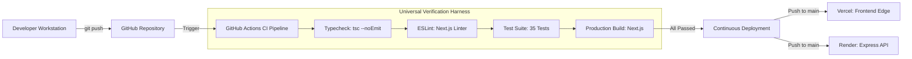

# CI/CD & Automated Release Pipeline

> **Document Status:** Verified against workflow code  
> **Last Verified Date:** 2026-10-05  
> **Commit Hash:** `audit-complete` / `audit/2026-10-05`  
> **Author:** Principal DevOps & Launch Lead  

---

## 1. Overview & Architecture

The Law Kaksha employs a GitOps continuous integration and continuous deployment (CI/CD) workflow linking GitHub, Vercel (Frontend), and Render (Backend).

---

## 2. CI Verification Pipeline (`.github/workflows/ci.yml`)

The monorepo includes a strict GitHub Actions workflow ensuring no breaking change or security regression reaches `main`.

### Pipeline Stages
1. **Dependency Installation:** Deterministic package installation via `npm ci` for root, frontend, and backend workspaces.
2. **Type Safety Validation:** Strict TypeScript compilation check via `npm run typecheck --prefix frontend`.
3. **Lint & Code Style:** ESLint inspection via `npm run lint --prefix frontend`.
4. **Backend Integration Tests:** Ephemeral test server execution via `npm test --prefix backend` executing all 35 tests across authentication, DRM, catalog, and OWASP security suites.
5. **Production Build Verification:** Complete bundle compilation via `npm run build:frontend`.

---

## 3. Deployment Targets & Automation

### A. Frontend (Vercel)
- **Framework Preset:** Next.js
- **Root Directory:** `thelawkaksha/frontend`
- **Build Command:** `next build --webpack`
- **Output Directory:** `.next`
- **Preview Deployments:** Automatic per-pull request ephemeral preview URLs for regression testing.
- **Production URL:** `https://thelawkaksha.com` (custom domain with automatic TLS).

### B. Backend API (Render)
- **Service Name:** `the-law-kaksha-api`
- **Environment:** Node.js
- **Root Directory:** `thelawkaksha/backend`
- **Build Command:** `npm install`
- **Start Command:** `node src/server.js`
- **Health Check Path:** `/api/health`
- **Auto-Deploy:** Enabled on merge to `main`.

---

## 4. Release Promotion Checklist

Before promoting any release to production:
- [ ] Universal verification harness passes locally: `npm run verify`.
- [ ] No high or critical security alerts in `npm audit`.
- [ ] Database backup snapshot created: `npm run db:backup`.
- [ ] Git commit tagged with semantic release tag (e.g., `v1.0.0`).
- [ ] Post-deploy smoke test executed against `/healthz` and `/readyz`.
