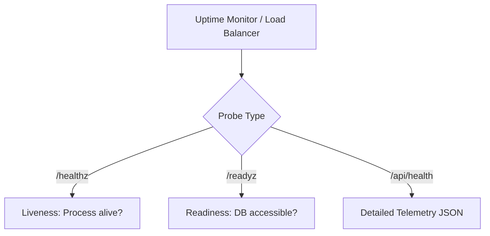

# Monitoring, Telemetry & Health Checks

> **Document Status:** Verified against server code  
> **Last Verified Date:** 2026-10-05  
> **Commit Hash:** `audit-complete` / `audit/2026-10-05`  
> **Author:** Principal DevOps & Launch Lead  

---

## 1. Health & Readiness Probe Architecture

The Law Kaksha backend implements enterprise-grade health endpoints conforming to standard container and cloud orchestrator conventions:



### Endpoints
- **`GET /healthz`:** Micro-liveness probe returning `200 OK` (`{"status":"ok"}`). Zero overhead; indicates Express event loop responsiveness.
- **`GET /readyz`:** Readiness probe checking database connectivity (MongoDB Atlas or Local JSON fallback). Returns `200 OK` when ready to serve requests.
- **`GET /api/health`:** Telemetry and diagnostics endpoint returning JSON metadata:
  ```json
  {
    "status": "healthy",
    "timestamp": "2026-10-05T08:10:00.000Z",
    "uptimeSeconds": 3412.5,
    "environment": "production",
    "database": {
      "mode": "mongodb",
      "connected": true,
      "state": "connected"
    },
    "memory": {
      "rssMB": 48.2,
      "heapUsedMB": 24.1
    }
  }
  ```

---

## 2. Structured Logging & Privacy Guardrails

1. **Format:** Morgan HTTP request logger configured in Apache/combined or structured format.
2. **PII Sanitization:** Password hashes, payment card details, and auth tokens are explicitly stripped from request loggers.
3. **Audit Trails:** Administrative modifications (`/api/admin/*`) and security events (device conflicts, rate limit hits) emit structured warning events.

---

## 3. Recommended Production Monitoring Stack

| Monitoring Layer | Recommended Service | Free Tier / Budget Option | Key Metric Monitored |
|---|---|---|---|
| **External Uptime** | Better Stack / UptimeRobot | Free (5-min intervals) | HTTP 200 on `/healthz` & `/api/health` |
| **Error Tracking** | Sentry (Next.js & Express) | Free Developer Tier | Uncaught exceptions, frontend console errors |
| **Performance (APM)** | Render Metrics + Vercel Analytics | Included | Memory utilization, HTTP 5xx rate, response time |
| **Alerting Channel** | Slack / Discord / WhatsApp Webhook | Free | Critical alerts: downtime > 2 min, DB disconnect |

---

## 4. Alert Thresholds & Severity Matrix

| Alert Name | Trigger Condition | Severity | Escalation Procedure |
|---|---|---|---|
| **API Down (5xx / Unreachable)** | Failed health check for 2 consecutive checks (2 min) | **P0 - Critical** | SRE on-call paged; verify Render instance state |
| **Database Disconnected** | `/readyz` returns 503 Service Unavailable | **P0 - Critical** | Inspect Atlas IP whitelist & fall back to local store |
| **Payment Verification Failure Spike**| > 3 failed signature verifications in 10 minutes | **P1 - High** | Inspect Razorpay webhook secrets and key configuration |
| **High Memory (> 85%)** | Node.js RSS > 420 MB on 512 MB container | **P2 - Medium** | Restart container via Render dashboard; inspect memory leaks |
