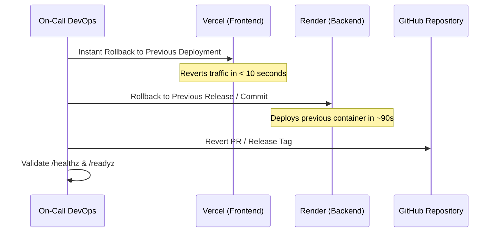

# Production Deployment Rollback Runbook

> **Document Status:** Verified against Git & Hosting platforms  
> **Last Verified Date:** 2026-10-05  
> **Commit Hash:** `audit-complete` / `audit/2026-10-05`  
> **Author:** Principal DevOps & SRE Lead  

---

## 1. Rollback Triggers & Thresholds

Initiate an immediate production rollback if any of the following conditions persist for $> 5$ minutes following a release:
- Any P0 failure mode (payment verification failure rate $> 10\%$).
- Complete unavailability of student login (`POST /api/auth/login` returns 500).
- Frontend runtime crash preventing page rendering across $> 5\%$ of sessions.
- Inability of 3D reader to stream study notes to authenticated students.

---

## 2. Immediate Rollback Execution Steps



### Step 1: Frontend Rollback (Vercel) — Duration: < 30 seconds
1. Open [Vercel Dashboard](https://vercel.com) $\to$ Select project `the-law-kaksha-frontend`.
2. Navigate to **Deployments**.
3. Locate the previous stable production deployment.
4. Click the three dots `...` on that deployment $\to$ Click **Instant Rollback**.
5. Traffic is instantly routed to the previous build across the global CDN edge.

### Step 2: Backend Rollback (Render) — Duration: ~90 seconds
1. Open [Render Dashboard](https://dashboard.render.com) $\to$ Select `the-law-kaksha-api`.
2. Go to **Events** or **Deploys**.
3. Select the previously verified working deploy.
4. Click **Rollback to this deploy**.
5. Render spins up the previous container image and directs traffic as soon as `/api/health` passes.

### Step 3: Git State Rollback
1. Checkout the previous release tag or baseline:
   ```bash
   git checkout main
   git revert -m 1 HEAD --no-edit
   git push origin main
   ```
2. Verify GitHub Actions CI runs clean on the reverted commit.

---

## 3. Post-Rollback Validation Checklist
- [ ] `GET /healthz` returns `200 OK`.
- [ ] `GET /readyz` returns `200 OK` with database status `connected`.
- [ ] Test purchase flow in Razorpay sandbox mode.
- [ ] Test student login on active device.
- [ ] Post incident notice to team communication channel and update `SESSION_LOG.md`.
