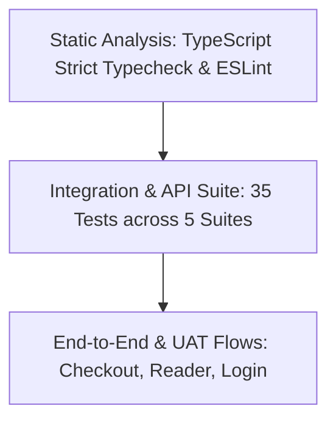

# Quality Assurance & Testing Strategy

> **Document Status:** Verified against test runner code  
> **Last Verified Date:** 2026-10-05  
> **Commit Hash:** `audit-complete` / `audit/2026-10-05`  
> **Author:** Principal QA & Test Engineering Lead  

---

## 1. Testing Philosophy & Quality Pyramid

The Law Kaksha testing methodology ensures that mission-critical academic journeys (authentication, order integrity, single-device DRM protection, and data privacy) remain regression-free and secure at all times.



### Key Pillars
1. **Zero-Flake Ephemeral Execution:** Integration tests boot an isolated, ephemeral in-memory Express instance with dynamic port allocation, eliminating port collision (`ECONNREFUSED` or `EADDRINUSE`) in local and CI environments.
2. **Shift-Left Security Verification:** OWASP Top 10 vulnerabilities (A01 Broken Access Control, A02 Security Misconfiguration, A05 Security Injection) are codified into automated test assertions.
3. **Behavioral Characterization:** Tests validate exact contract expectations (HTTP response status codes, payload structures, single-device conflict resolution).

---

## 2. Test Execution Harness

The project defines a single universal verification command that coordinates all testing layers:
```bash
# Execute universal verification protocol
npm run verify
```

### Breakdown of Verification Stages
| Order | Suite | Command | Execution Scope | Target Pass Rate |
|:---:|---|---|---|:---:|
| 1 | **Frontend Static Typecheck** | `npm run typecheck --prefix frontend` | TypeScript compiler (`tsc --noEmit`) checking all pages, components, and types | 100% (0 errors) |
| 2 | **Frontend Code Linting** | `npm run lint --prefix frontend` | ESLint rules for Next.js and React hooks | 100% (0 errors) |
| 3 | **Backend Test Suite** | `npm test --prefix backend` | Node.js native test runner (`node:test`) executing 35 tests | 100% (35/35) |
| 4 | **Production Bundle Build** | `npm run build:frontend` | Next.js production build (`next build --webpack`) | 100% (20 routes) |

---

## 3. Test Suites & Coverage Scope

### Suite 1: Authentication & Single-Device Enforcement (`auth_device.test.js`)
- Candidate registration and duplicate prevention.
- Single-device login lock and conflict detection (`409 DEVICE_CONFLICT`).
- Forced session migration (`forceSwitchDevice: true`).
- Device heartbeat session revocation (`401 DEVICE_REVOKED`).
- Safe logout device unlocking.
- Password reset token generation and user enumeration prevention.

### Suite 2: Catalog & Public Content (`catalog.test.js`)
- Public site metadata and statutory curriculum comparison.
- Course catalog filtering by exam level (CA Foundation, CSEET).
- Health probes: `/api/health`, `/healthz`, and `/readyz`.

### Suite 3: Order Verification & DRM License Pass (`orders_drm.test.js`)
- Server-side price calculation and order initialization.
- Razorpay HMAC signature verification and student provisioning.
- Tampered signature rejection (`400 Bad Request`).
- Minimum order amount validation.

### Suite 4: Admin Access Control (OWASP A01) (`admin_security.test.js`)
- Rejection of unauthenticated access to admin routes (`401 Unauthorized`).
- Rejection of non-admin student tokens (`403 Forbidden`).
- Authorized admin access to student and product directories.

### Suite 5: Security Hardening & Zero-Trust (`security_hardening.test.js`)
- Server security headers (CSP, HSTS, `X-Content-Type-Options`).
- Suppression of `X-Powered-By`.
- Neutralization of NoSQL operator injection payloads (`{"$gt": ""}`).
- Insecure direct object reference (IDOR) guards on student dashboards and orders.
- Confirmation of legacy backdoor endpoint deletion (`404 Not Found`).

---

## 4. Test Environment Isolation

- **In-Memory Port Allocation:** Ephemeral servers bind to `port: 0`, allowing the OS to assign free ports dynamically.
- **Database Isolation:** Integration tests leverage mock data or local temporary JSON stores that are reset upon test teardown.
- **Test Secrets:** Dedicated test JWT secrets (`JWT_SECRET="test_secret_for_audit"`) are utilized strictly within test runners.
