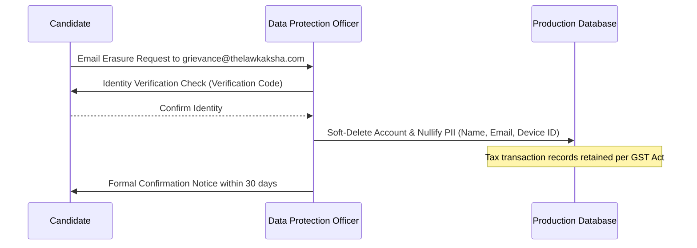

# Data Retention & Erasure Policy (DPDP Act 2023)

> **Notice:** DRAFT: requires review by a qualified lawyer before publication. Not legal advice.  
> **Last Updated:** 2026-10-05  
> **Version:** 1.0.0-draft  
> **Statutory Alignment:** Digital Personal Data Protection Act, 2023 (India)  

---

## 1. Statutory Background

In adherence to the *Digital Personal Data Protection Act, 2023 (DPDP Act)*, The Law Kaksha operates under the principle of **storage limitation**: personal data is retained only for the duration necessary to satisfy the specific educational purpose for which consent was originally granted.

---

## 2. Data Retention Schedules

| Category of Personal Data | Primary Purpose | Retention Period | Post-Retention Action |
|---|---|---|---|
| **Candidate Account Data** (Name, Email, Password Hash) | Authentication & Course Delivery | Active enrollment duration + 1 examination cycle (approx. 180 days) | Anonymized or permanently erased upon request |
| **Phone / WhatsApp Number** | Critical exam countdowns & OTP login | Term of active course subscription | Purged from notification queues upon course expiration |
| **Hardware Device Fingerprint** | Single-device DRM access control | Duration of active login session | Overwritten upon device switch or session logout |
| **Payment Transaction Records** (Order ID, Payment ID, Amount) | Tax invoicing & GST accounting compliance | 8 financial years (as mandated by Indian Income Tax & GST laws) | Archived in cold storage |
| **Mock Test Submissions & Scores** | Academic progress tracking | 90 days following examination attempt | Aggregated into anonymous statistical benchmarks |

---

## 3. Candidate Right to Erasure Workflow

Under Section 12(3) of the DPDP Act 2023, every enrolled student possesses the right to request deletion of their personal profile data:

### Steps to Request Erasure:
1. Send an email from your registered email address to `grievance@thelawkaksha.com` with subject: `DPDP Data Erasure Request - [Your Name]`.
2. Our Grievance Redressal Team will verify your request and process deletion within **30 calendar days** as required by statutory rules.
