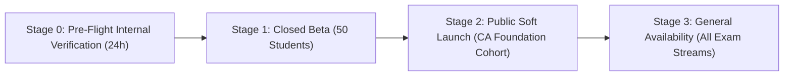

# Platform Launch Plan & Staged Rollout

> **Purpose:** Detailed operational roadmap, deployment phases, traffic migration, and launch milestones for The Law Kaksha.  
> **Status:** Verified against code  
> **Last Verified:** 2026-10-05 (`audit/2026-10-05`)  
> **Owner:** Launch Commander / DevOps  

---

## 1. Staged Rollout Strategy

### Stage 0: Pre-Flight Internal Verification
- Deploy backend to Render production environment with MongoDB Atlas Cluster0 connection.
- Deploy frontend to Vercel production environment with custom domain (`thelawkaksha.com`).
- Execute end-to-end sandbox Razorpay payment transactions (₹99 subscription).
- Verify single-device enforcement on physical mobile phone and desktop browser.

### Stage 1: Closed Beta (50 Students)
- Invite 50 pilot CA Foundation students via WhatsApp/Telegram community.
- Monitor error tracking, database connection pool stability, and PDF rendering latency across low-bandwidth networks.
- Collect usability feedback on Section 16 model answer comparison and DRM reader watermarking.

### Stage 2: Public Soft Launch
- Open public registration for CA Foundation Paper 2: Business Laws at promotional ₹99/month.
- Run daily automated database backups.
- Monitor sliding-window rate limiters for any false positives.

### Stage 3: General Availability
- Launch CSEET Paper 2: Business Law and Management modules.
- Activate full catalog and multi-volume master pass checkout.
