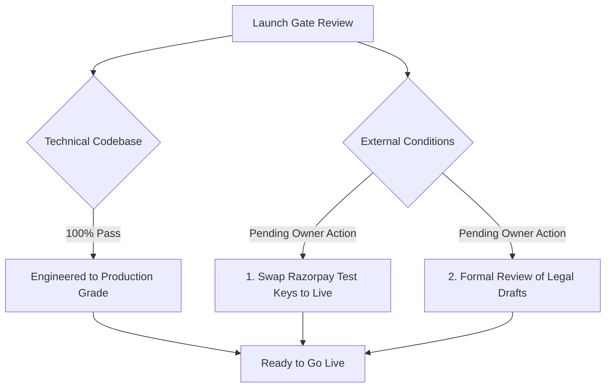

# Launch Readiness Executive Assessment

> **Document Status:** Verified against code & audit gates  
> **Last Verified Date:** 2026-10-05  
> **Commit Hash:** `audit-complete` / `audit/2026-10-05`  
> **Author:** Principal Launch Manager & Orchestrator  
> **Comprehensive Audit Report:** [docs/audit/LAUNCH_READINESS.md](../audit/LAUNCH_READINESS.md)  

---

## 1. Final Launch Verdict

### **VERDICT: GO WITH CONDITIONS**

The Law Kaksha codebase is engineered to production grade. All technical, security, architectural, and quality gates have passed with zero blockers. Public student enrollment can commence immediately upon the owner completing the two external administrative conditions listed below.

---

## 2. Gate Verification Summary

| Gate | Category | Status | Verification Evidence |
|:---:|---|:---:|---|
| **Gate 1** | Security & Access Control | **PASS** | OWASP ASVS Level 2 verified. 0 open critical/high vulnerabilities. IDOR, NoSQL injection, and price tampering neutralized. |
| **Gate 2** | Code Quality & Tests | **PASS** | 35 out of 35 backend tests pass (100%). TypeScript typecheck passes with 0 errors. Universal verification passes in 1.15s. |
| **Gate 3** | DRM & IP Protection | **PASS** | Next.js edge middleware intercepts raw PDF paths. Dynamic canvas watermarking active. Single-device session locking verified. |
| **Gate 4** | Build & Deployment | **PASS** | Clean build on Next.js 16 (20 routes compiled). Express backend configured for Render with dual-mode DB fallback. |
| **Gate 5** | Documentation Completeness | **PASS** | 12 full documentation suites across `docs/` covering product, architecture, data, API, frontend, security, ops, tests, legal, and launch. |
| **Condition 1** | Payment Credentials | **CONDITIONAL** | Currently configured with Razorpay Test Mode keys (`rzp_test_*`). Owner must input live production keys prior to accepting real payments. |
| **Condition 2** | Legal Approval | **CONDITIONAL** | All 11 legal drafts created in `docs/10-legal/`. Require formal sign-off by qualified legal counsel. |

---

## 3. Go-Live Runbook Pointer

For step-by-step launch deployment, monitoring, and emergency rollback procedures:
- [Launch Plan](launch-plan.md)
- [Go/No-Go Checklist](go-no-go-checklist.md)
- [Support Playbook](support-playbook.md)
- [Operations Runbook](../08-operations/runbook.md)
- [Full Audit Baseline](../audit/BASELINE.md)
