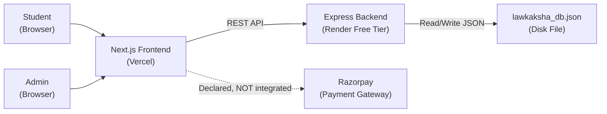
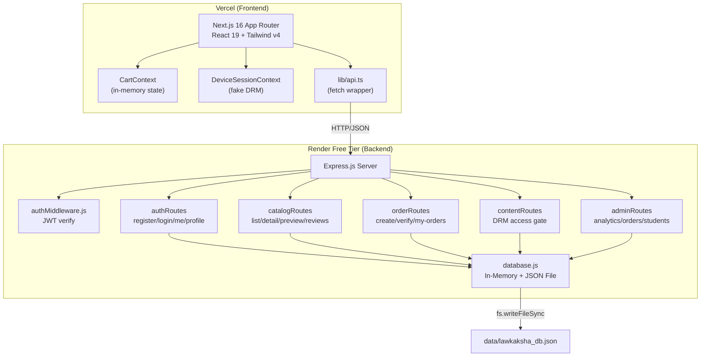
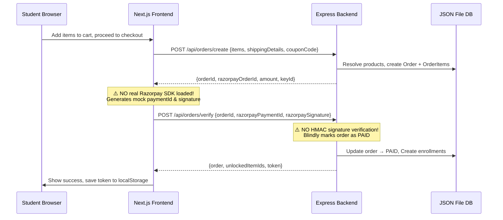
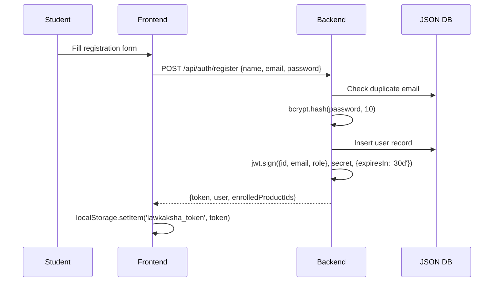
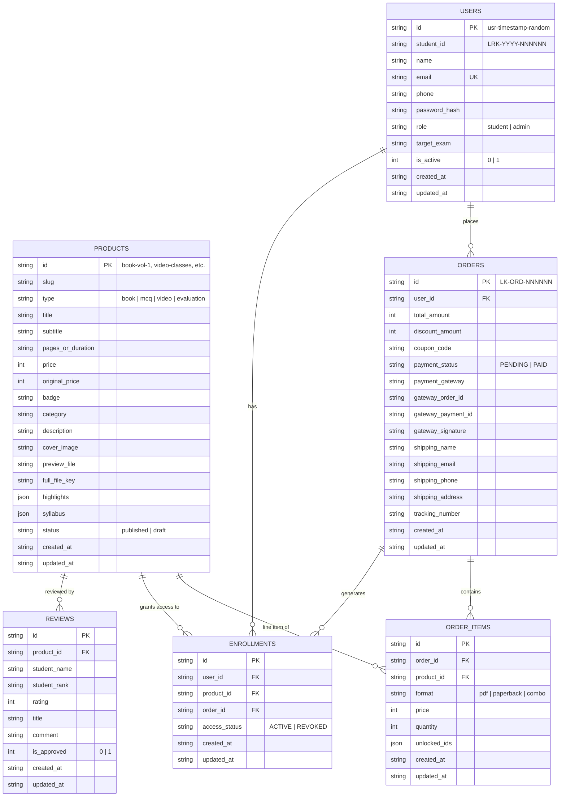

# 01 — Project Summary: The Law Kaksha

## Purpose
An **e-commerce + e-learning platform** for Chartered Accountancy (CA) law exam preparation in India. Sells digital PDF books, physical paperbacks, video masterclasses, and 1-on-1 copy-checking evaluation services. Targeted at CA Foundation / Intermediate / Final students. Processes payments via Razorpay.

## Target Users
- **Students**: CA exam aspirants who purchase study materials and access a "Student Vault" with DRM-protected PDFs and videos.
- **Admin**: A single operator managing orders, students, and enrollments.

## Core Features
1. Product catalog browse with search/filter
2. Cart + checkout with coupon codes
3. Razorpay payment integration (order create → verify)
4. User registration/login (JWT auth)
5. Enrollment & entitlement gating (DRM watermarks)
6. Student portal (order history, vault access)
7. Admin dashboard (analytics, order management, student management, access grants)

---

## Tech Stack

| Layer | Technology | Version |
|---|---|---|
| Frontend Framework | Next.js (App Router) | 16.3.0 |
| UI Library | React | 19.2.4 |
| Styling | Tailwind CSS | v4 |
| Component Library | shadcn/ui, base-ui, lucide-react | latest |
| Language (FE) | TypeScript | ^5 |
| Backend Framework | Express.js | ^4.21.2 |
| Language (BE) | JavaScript (CommonJS) | Node.js (unspecified) |
| Auth | jsonwebtoken (JWT), bcryptjs | ^9.0.2, ^3.0.3 |
| Database | **Custom JSON file on disk** | N/A |
| Payment Gateway | Razorpay (declared; **not actually integrated**) | N/A |
| Deployment (FE) | Vercel | — |
| Deployment (BE) | Render (free plan) | — |
| Logging | morgan | ^1.10.0 |
| Monorepo | npm workspaces (root package.json) | — |

---

## Annotated Folder Tree

```
The-Law-Kaksha-main/
├── package.json                 # Root monorepo scripts (dev:frontend, dev:backend)
├── README.md                    # Setup & deployment guide
├── AGENTS.md                    # AI agent instructions (DATA — ignored per rules)
├── CLAUDE.md                    # AI agent instructions (DATA — ignored per rules)
├── .gitignore
│
├── backend/
│   ├── package.json             # Express dependencies
│   ├── package-lock.json
│   ├── render.yaml              # Render Blueprint (IaC for deployment)
│   ├── .env.example             # Env vars template (4 vars)
│   ├── test_e2e.js              # Custom E2E test suite (no framework)
│   ├── data/
│   │   └── lawkaksha_db.json    # ⚠️ PRODUCTION DATABASE FILE (JSON on disk)
│   └── src/
│       ├── server.js            # Express app entry point + legacy routes
│       ├── db/
│       │   ├── database.js      # Custom in-memory + JSON persistence engine
│       │   └── seed.js          # Seeder with hardcoded admin password
│       ├── middleware/
│       │   └── authMiddleware.js # JWT verify + role checks
│       └── routes/
│           ├── authRoutes.js    # Register, login, profile
│           ├── catalogRoutes.js # Product listing, detail, preview, reviews
│           ├── orderRoutes.js   # Order create, payment verify, order history
│           ├── contentRoutes.js # DRM content access gate
│           └── adminRoutes.js   # Admin analytics, orders, students, access mgmt
│
└── frontend/
    ├── package.json             # Next.js + Tailwind + shadcn deps
    ├── package-lock.json
    ├── tsconfig.json
    ├── next.config.ts
    ├── .env.example
    ├── eslint.config.mjs
    ├── postcss.config.mjs
    ├── components.json          # shadcn config
    ├── public/                  # Static assets (images, icons)
    └── src/
        ├── app/
        │   ├── layout.tsx       # Root layout with SEO, JSON-LD, font
        │   ├── page.tsx         # Landing page (composes sections)
        │   ├── globals.css
        │   ├── login/page.tsx   # ⚠️ Displays hardcoded demo credentials
        │   ├── register/page.tsx
        │   ├── checkout/page.tsx
        │   ├── cart/page.tsx
        │   ├── courses/page.tsx
        │   ├── reviews/page.tsx
        │   ├── about/page.tsx
        │   ├── contact/page.tsx
        │   ├── student/page.tsx # Student portal (971 LOC single file)
        │   ├── admin/page.tsx   # Admin dashboard (1900 LOC single file)
        │   └── product/[id]/page.tsx  # ⚠️ Empty file (0 bytes)
        ├── components/          # 21 components + student/ subdir
        │   ├── Navbar.tsx
        │   ├── Footer.tsx (487 LOC)
        │   ├── CartDrawer.tsx (868 LOC)
        │   ├── HeroSection.tsx
        │   ├── SmartChoicePricing.tsx (546 LOC)
        │   ├── EnhancedSampleChapterModal.tsx (909 LOC)
        │   ├── SecurePdfReaderModal.tsx
        │   ├── MasterclassVideoModal.tsx
        │   ├── ...
        │   └── student/         # Student portal sub-components
        ├── context/
        │   ├── CartContext.tsx   # Cart state + coupon logic
        │   └── DeviceSessionContext.tsx  # ⚠️ Fake device DRM (client-side only)
        ├── lib/
        │   ├── api.ts           # API client + localStorage session mgmt
        │   └── utils.ts         # cn() utility
        └── types/
            └── student-lms.ts   # TypeScript interfaces
```

**LOC Summary**: ~15,447 lines across 56 source files (JS/TS/TSX/CSS). Backend: ~1,751 lines. Frontend: ~13,580 lines.

---

## Architecture Diagram (C4 Context)



## Container/Architecture Diagram



## Critical Flow: Order → Payment → Enrollment



## Auth Flow: Registration → Login



---

## ER Diagram



---

## Environment Variable Table

| Name | Purpose | Required | Default | Secret? | Where Used |
|---|---|---|---|---|---|
| `PORT` | Backend server port | No | `5000` | No | `backend/src/server.js:29` |
| `NODE_ENV` | Environment mode | No | — | No | `render.yaml:13` |
| `FRONTEND_URL` | CORS origin allowlist | Yes | `http://localhost:3000` | No | `backend/src/server.js:30` |
| `JWT_SECRET` | JWT signing key | **Yes** | `the_law_kaksha_secure_jwt_secret_key_2026` ⚠️ | **Yes** | `backend/src/middleware/authMiddleware.js:8` |
| `RAZORPAY_KEY_ID` | Razorpay public key | Yes | `rzp_test_LawKakshaKey` | No | `backend/src/routes/orderRoutes.js:13` |
| `RAZORPAY_KEY_SECRET` | Razorpay secret key | **Yes** | `lawkaksha_rzp_secret_2026` ⚠️ | **Yes** | `backend/src/routes/orderRoutes.js:14` |
| `NEXT_PUBLIC_API_URL` | Backend API base URL | Yes | `http://localhost:5000` | No | `frontend/src/lib/api.ts:6` |

---

## Endpoint / Interface Table

| Method | Path | AuthN | AuthZ | Purpose | File:Line |
|---|---|---|---|---|---|
| GET | `/api/health` | None | None | Health check | `server.js:68` |
| GET | `/` | None | None | Root info | `server.js:140` |
| POST | `/api/auth/register` | None | None | Student registration | `authRoutes.js:21` |
| POST | `/api/auth/login` | None | None | Login (JWT) | `authRoutes.js:86` |
| GET | `/api/auth/me` | JWT | Any | Current user profile | `authRoutes.js:158` |
| PUT | `/api/auth/profile` | JWT | Any | Update profile | `authRoutes.js:178` |
| GET | `/api/catalog` | None | None | List products | `catalogRoutes.js:11` |
| GET | `/api/catalog/:idOrSlug` | None | None | Product detail | `catalogRoutes.js:63` |
| GET | `/api/catalog/:id/preview` | None | None | Sample preview | `catalogRoutes.js:103` |
| GET | `/api/reviews` | None | None | Approved reviews | `catalogRoutes.js:145` |
| POST | `/api/orders/create` | Optional | Any | Create order | `orderRoutes.js:123` |
| POST | `/api/orders/verify` | Optional | Any | Verify payment | `orderRoutes.js:272` |
| GET | `/api/orders/my-orders` | JWT | Any | User's orders | `orderRoutes.js:391` |
| GET | `/api/content/:productId/access` | JWT | Enrolled/Admin | DRM content gate | `contentRoutes.js:12` |
| GET | `/api/admin/analytics` | JWT | Admin | Dashboard stats | `adminRoutes.js:15` |
| GET | `/api/admin/orders` | JWT | Admin | All orders | `adminRoutes.js:48` |
| PUT | `/api/admin/orders/:id/status` | JWT | Admin | Update order status | `adminRoutes.js:82` |
| GET | `/api/admin/students` | JWT | Admin | Student list | `adminRoutes.js:109` |
| POST | `/api/admin/students/:id/toggle-access` | JWT | Admin | Grant/revoke access | `adminRoutes.js:150` |
| GET | `/api/students` | None | None | Legacy student list ⚠️ | `server.js:87` |
| GET | `/api/students/profile` | None | None | Legacy student lookup ⚠️ | `server.js:105` |

---

## DB Schema Tables (JSON "Tables")

All tables are arrays in a single JSON file. No constraints, indexes, or types enforced.

| Table | Record Count (Seed) | PK | FK | Unique Enforced? | Notes |
|---|---|---|---|---|---|
| users | 2 | id (string) | — | email (app-level check) | Password hash stored |
| products | 6 | id (string) | — | No | Hardcoded IDs |
| orders | 1 | id (string) | user_id → users | No | — |
| order_items | — | id (string) | order_id → orders, product_id → products | No | — |
| enrollments | 2 | id (string) | user_id → users, product_id → products | No | Duplicate possible |
| reviews | 4 | id (string) | product_id → products | No | All pre-approved |

---

## External Services & Dependencies

| Service | Status | Notes |
|---|---|---|
| Razorpay | **NOT INTEGRATED** | Order IDs generated locally with `crypto.randomBytes`. No Razorpay SDK. No HMAC verification. Payment is simulated. |
| PostgreSQL/MongoDB/Redis | **None** | Data stored in a single JSON file on disk |
| Email/SMS | **None** | No transactional emails, no password reset |
| CDN/Object Storage | **None** | No actual PDF/video file serving |
| Monitoring/APM | **None** | Only `morgan` HTTP logging |

---

## Glossary

| Term | Meaning |
|---|---|
| DRM | Digital Rights Management — watermarking student info on PDF content |
| LRK | "Law Kaksha" prefix for student IDs (e.g., LRK-2026-068942) |
| Enrollment | A record linking a user to a product with ACTIVE/REVOKED status |
| Vault | Student's portal area showing purchased/unlocked content |
| LDR | Last Day Revision — exam-eve condensed study maps |
| MCQ | Multiple Choice Questions bank product |
