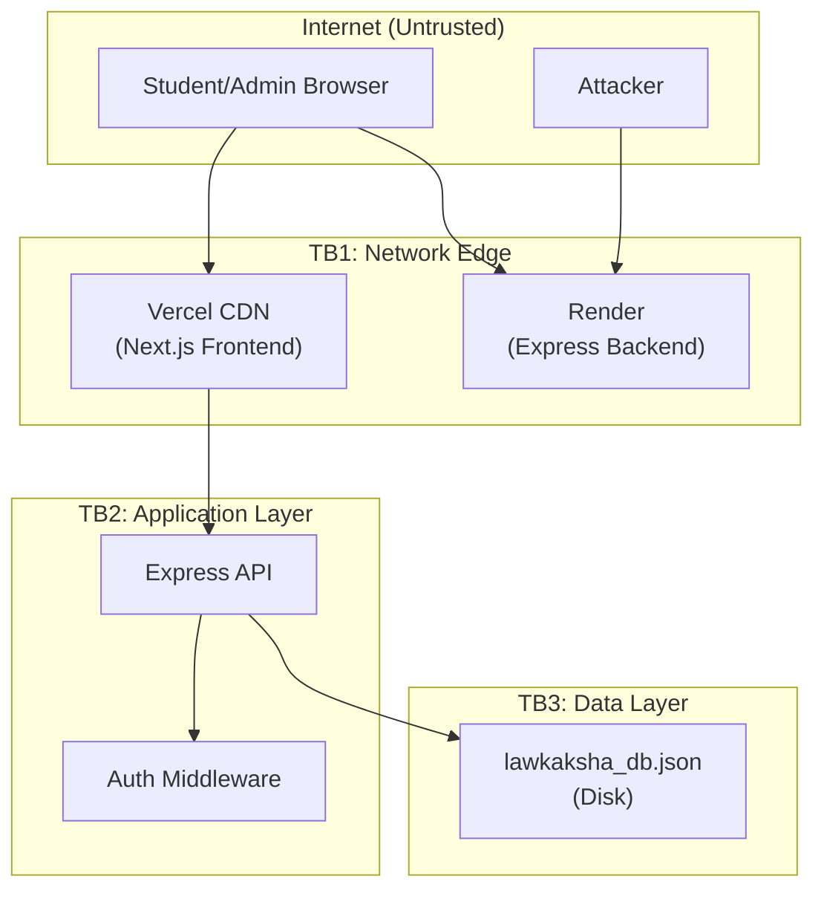

# 06 — Threat Model (STRIDE)

## Trust Boundaries

---

## STRIDE Analysis per Trust Boundary

### TB1: Network Edge (Internet → Vercel/Render)

| Threat | Category | Risk | Current Mitigation | Finding |
|---|---|---|---|---|
| Impersonate any origin via CORS bypass | **Spoofing** | HIGH | None — CORS allows all origins (server.js:46) | SEC-004 |
| Inject malicious payloads (XSS, SQLi) | **Tampering** | MEDIUM | None — no input validation, no CSP header | SEC-009, SEC-010 |
| Eavesdrop on HTTP traffic | **Info Disclosure** | LOW | TLS provided by Vercel/Render by default | ✅ Mitigated |
| Brute-force login endpoint | **DoS** | HIGH | None — no rate limiting | SEC-008 |
| DDoS via unbounded requests | **DoS** | HIGH | None — no rate limiting, no WAF | SEC-008 |

### TB2: Application Layer (API Router → Auth → Business Logic)

| Threat | Category | Risk | Current Mitigation | Finding |
|---|---|---|---|---|
| Forge JWT tokens using hardcoded secret | **Spoofing** | CRITICAL | None — secret is in source code | SEC-002 |
| Bypass payment verification with fake signature | **Tampering** | CRITICAL | None — no HMAC verification | SEC-001 |
| Steal another user's order via IDOR | **Tampering** | HIGH | None — order reassignment logic enables it | SEC-011 |
| Escalate to admin via forged JWT | **Elevation of Privilege** | CRITICAL | None — secret enables forging admin tokens | SEC-002 |
| Enumerate user accounts via registration | **Info Disclosure** | MEDIUM | None — distinct error for existing email | SEC-014 |
| Access student PII without auth | **Info Disclosure** | HIGH | None — legacy endpoints are unauthenticated | SEC-007 |
| Read admin credentials from login page | **Info Disclosure** | HIGH | None — credentials displayed in UI | SEC-006 |
| Session hijacking via localStorage theft | **Spoofing** | MEDIUM | None — tokens in localStorage vulnerable to XSS | SEC-015 |

### TB3: Data Layer (Application → JSON File)

| Threat | Category | Risk | Current Mitigation | Finding |
|---|---|---|---|---|
| Corrupt database via concurrent writes | **Tampering** | HIGH | Partial — atomic rename, but no locking | DATA-003 |
| Lose all data via file deletion/corruption | **Denial of Service** | CRITICAL | None — no backups, no replication | DATA-002 |
| Exploit mass assignment to pollute data | **Tampering** | MEDIUM | None — no schema validation on insert | SEC-010 |
| No audit trail of data modifications | **Repudiation** | HIGH | None — no audit logging | — |

---

## RBAC / Authorization Matrix

| Resource \ Role | Anonymous | Student (JWT) | Admin (JWT) |
|---|---|---|---|
| `GET /api/health` | ✅ | ✅ | ✅ |
| `GET /api/catalog` | ✅ | ✅ | ✅ |
| `GET /api/catalog/:id` | ✅ | ✅ | ✅ |
| `GET /api/catalog/:id/preview` | ✅ | ✅ | ✅ |
| `GET /api/reviews` | ✅ | ✅ | ✅ |
| `POST /api/auth/register` | ✅ | ✅ | ✅ |
| `POST /api/auth/login` | ✅ | ✅ | ✅ |
| `GET /api/auth/me` | ❌ 401 | ✅ | ✅ |
| `PUT /api/auth/profile` | ❌ 401 | ✅ (own only) | ✅ (own only) |
| `POST /api/orders/create` | ✅ ⚠️ optionalAuth | ✅ | ✅ |
| `POST /api/orders/verify` | ✅ ⚠️ optionalAuth | ✅ | ✅ |
| `GET /api/orders/my-orders` | ❌ 401 | ✅ (own only) | ✅ (own only) |
| `GET /api/content/:id/access` | ❌ 401 | ✅ (enrolled only) | ✅ (all) |
| `GET /api/admin/analytics` | ❌ 401/403 | ❌ 403 | ✅ |
| `GET /api/admin/orders` | ❌ 401/403 | ❌ 403 | ✅ |
| `PUT /api/admin/orders/:id/status` | ❌ 401/403 | ❌ 403 | ✅ |
| `GET /api/admin/students` | ❌ 401/403 | ❌ 403 | ✅ |
| `POST /api/admin/students/:id/toggle-access` | ❌ 401/403 | ❌ 403 | ✅ |
| `GET /api/students` ⚠️ LEGACY | ✅ ⚠️ **NO AUTH** | ✅ | ✅ |
| `GET /api/students/profile` ⚠️ LEGACY | ✅ ⚠️ **NO AUTH** | ✅ | ✅ |

### Critical AuthZ Gaps:
1. **`/api/students`** and **`/api/students/profile`** — Completely unauthenticated. Expose all student PII. [SEC-007]
2. **`/api/orders/create`** and **`/api/orders/verify`** — Only `optionalAuth`. Allows anonymous users to create orders and mark them as paid. Combined with SEC-001, this is a free content access path.
3. **Order verification** — No check that the requester owns the order being verified. Any user can verify any order. [SEC-011]
4. **Profile update** — Only updates the authenticated user's own profile, which is correct. However, no field-level validation exists. [SEC-010]

---

## OWASP Top 10 (2021) Mapping

| OWASP 2021 | Finding | Status |
|---|---|---|
| A01: Broken Access Control | SEC-004, SEC-007, SEC-011 | ❌ Multiple violations |
| A02: Cryptographic Failures | SEC-002, SEC-003 (hardcoded keys) | ❌ Critical |
| A03: Injection | SEC-010 (no input validation) | ⚠️ Risk, not exploited (no SQL) |
| A04: Insecure Design | SEC-001, SEC-005 (payment bypass by design) | ❌ Critical |
| A05: Security Misconfiguration | SEC-004, SEC-009 (CORS, headers) | ❌ Multiple |
| A06: Vulnerable Components | Not verified (no CVE scan run) | ⚠️ Unknown |
| A07: Identification & Auth Failures | SEC-002, SEC-008, SEC-012, SEC-013 | ❌ Multiple |
| A08: Software & Data Integrity | SEC-001 (no payment signature verification) | ❌ Critical |
| A09: Security Logging & Monitoring | REL-003 (no structured logging) | ❌ Absent |
| A10: Server-Side Request Forgery | N/A (no outbound requests from user input) | ✅ N/A |

## OWASP API Top 10 (2023) Mapping

| OWASP API 2023 | Finding | Status |
|---|---|---|
| API1: Broken Object Level Authorization | SEC-011 (IDOR on order verify) | ❌ |
| API2: Broken Authentication | SEC-002, SEC-006, SEC-008 | ❌ |
| API3: Broken Object Property Level Authorization | SEC-010 (mass assignment) | ⚠️ |
| API4: Unrestricted Resource Consumption | SEC-008, PERF-001 (no limits) | ❌ |
| API5: Broken Function Level Authorization | SEC-007 (unauthenticated PII endpoints) | ❌ |
| API6: Unrestricted Access to Sensitive Business Flows | SEC-001, SEC-005 (payment bypass) | ❌ |
| API7: Server Side Request Forgery | N/A | ✅ |
| API8: Security Misconfiguration | SEC-004, SEC-009 | ❌ |
| API9: Improper Inventory Management | Legacy endpoints without auth | ⚠️ |
| API10: Unsafe Consumption of APIs | N/A (no third-party API calls) | ✅ |
