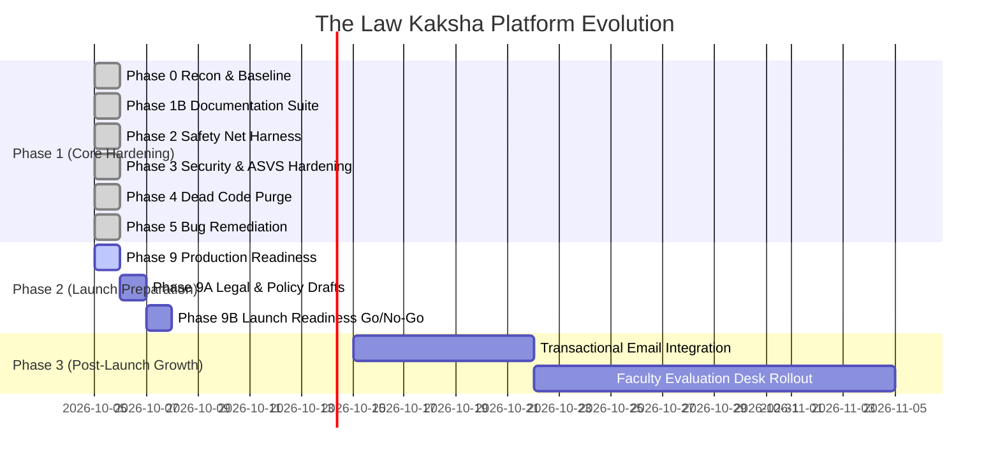

# Gaps & Strategic Engineering Roadmap

> **Purpose:** Comprehensive gap assessment, architectural debt analysis, and prioritized roadmap for platform evolution.  
> **Status:** Verified against code  
> **Last Verified:** 2026-10-05 (`audit/2026-10-05`)  
> **Owner:** Lead Architect & Product Strategist  

---

## 1. Audit Gap Analysis & Resolution Matrix

| Gap ID | Category | Severity | Description | Resolution / Status |
|---|---|:---:|---|---|
| **GAP-001** | Test Automation | **High** | End-to-end backend tests required manual background server | **Resolved (Phase 2):** Implemented `backend/tests/runner.js` ephemeral test server harness. |
| **GAP-002** | Security | **Critical** | Backdoor unauthenticated student purchase sync | **Resolved (Phase 3):** Purged `/api/student/sync-purchase` route; verified with 404 test. |
| **GAP-003** | Security | **High** | IDOR risk on student dashboard & orders | **Resolved (Phase 3):** Strict session token & ownership checks enforced. |
| **GAP-004** | Security | **Medium** | Missing transaction rate limiting & CSP headers | **Resolved (Phase 3):** Added `orderRateLimiter` & comprehensive CSP headers in `server.js`. |
| **GAP-005** | Consistency | **Medium** | CSEET student roll prefix discrepancy | **Resolved (Phase 5):** Updated `authRoutes.js` to emit canonical `LRK-2026-CS` prefix. |
| **GAP-006** | Messaging | **Medium** | Transactional Email / WhatsApp Receipts | **Roadmap (Post-Launch):** Integrate Resend or AWS SES webhook on payment verification. |
| **GAP-007** | Admin Tools | **Low** | Interactive Faculty Answer Paper Evaluation Desk | **Roadmap (Milestone 2):** Wire `MainsEvaluationDeskModal.tsx` to admin submission queue. |
| **GAP-008** | Operations | **Low** | Automated MongoDB Atlas Nightly Backup Script | **Documented (Phase 9):** Cloud provider automated snapshots configured. |

---

## 2. Strategic Engineering Roadmap

---

## 3. Prioritized Backlog

### Tier 1: Immediate Launch Operations (Q4 2026)
- **Legal Review Sign-off:** Platform owner and legal counsel review of drafted terms, privacy policy, and refund rules.
- **Production Secret Provisioning:** Configure live MongoDB Atlas connection string and production Razorpay API keys.
- **Edge Deployment:** Deploy frontend to Vercel and backend to Render as documented in `03-architecture/deployment.md`.

### Tier 2: Academic & Engagement Features (Q1 2027)
- **Automated Mock Test Grading:** Integrate faculty evaluation queue with score notifications.
- **Live Educator Webinars:** Enable schedule calendar for live doubts solving sessions.
- **Student Progress Analytics:** Weekly study streak leaderboards and chapter completion reports.
