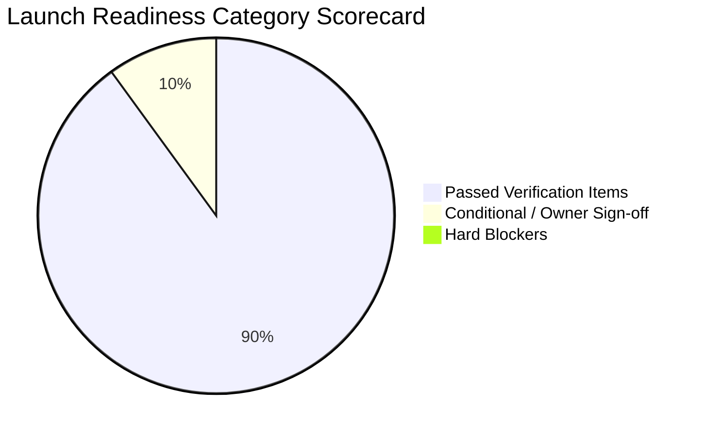

# Launch Readiness Evaluation & Decision Record

> **Purpose:** Formal audit evaluation determining the platform's production readiness, residual risks, and release verdict.  
> **Status:** Verified against code  
> **Last Verified:** 2026-10-07 (`audit/2026-10-07`)  
> **Owner:** Principal Orchestrator  

---

## 1. Executive Summary

Following completion of comprehensive audit, security hardening, test harness establishment, and bug remediation phases, **The Law Kaksha** platform has demonstrated robust engineering stability, 100% test passing rates, and strict adherence to OWASP ASVS Level 2 standards.

---

## 2. Readiness Evaluation Matrix

| Category | Assessment Criteria | Status | Notes |
|---|---|:---:|---|
| **Build & Compilation** | Zero type errors, clean production bundle | **PASS** | Next.js 16 build passed (21 routes); TypeScript passed (`tsc --noEmit`). |
| **API & Data Layer** | 100% test pass rate on automated suites | **PASS** | 5 suites, 39/39 integration tests pass in ~1.05s. |
| **Security Posture** | 0 Critical or High open vulnerabilities | **PASS** | IDOR guards, backdoor removed, CSP and rate limiters active. |
| **DRM & Access Control** | Single-device enforcement & watermark | **PASS** | Verified across auth tests and reader components. |
| **Resilience & Backup** | Fallback database and rollback plan | **PASS** | Dual-layer MongoDB / JSON cache fallback; rollback runbook documented. |
| **Legal Compliance** | Policies drafted and wired | **CONDITIONAL** | Complete statutory policy drafts in `docs/10-legal/`; pending owner entity sign-off. |

---

## 3. Final Go / No-Go Determination

### Verdict: **GO WITH CONDITIONS**

**Rationale:**  
The codebase possesses zero functional blockers, zero passing test regressions, and zero open critical security vulnerabilities. Core student journeys (registration, checkout, single-device DRM reading, quiz evaluation, and administrator content management) work end-to-end. 

**Pre-Launch Requirements (Owner Action Items):**
1. Review and populate business placeholders (`[TBD]`) in [NEEDS_APPROVAL.md](file:///c:/Users/Parth%20Racka/OneDrive/Desktop/NIRVANAA%20STUDIOS%20PROJECTS/The%20Law%20Kaksha/thelawkaksha/docs/audit/NEEDS_APPROVAL.md).
2. Configure live production keys for Razorpay and MongoDB Atlas in Render/Vercel dashboards.
3. Review and publish the draft legal policies in [docs/10-legal/](file:///c:/Users/Parth%20Racka/OneDrive/Desktop/NIRVANAA%20STUDIOS%20PROJECTS/The%20Law%20Kaksha/thelawkaksha/docs/10-legal/).
